## SQL 
> <b>Whast is the SQL ?</b><br>

SQL is a Structure Query Language and it is basically programming Language which is basically works with Realtional Database mangement System.

---
> <b>What is the database managment system ?</b><br>

Database is the <b>technique</b> where we can <b>Organize or Store</b> the data permanently for manage easily as well as access easily to user as well as database managament system provide relationship  between data internally.

---

><b>Why use the database or what are the benifits of a database ?
- Data Security :   </b>DBMS -(DataBase Managment System) enhance data security through <b>access control</b> and <b>encryption</b> as well as provide privacy policies and prevents unauthorized access when user numbers grow as well as provide the limited user access.

- <b>Data Integration :</b> We can easily integrated data with other application by maintaining centralized database.

- <b>Avoid Redundancy of data :</b>  With the help of database we can avoid the duplication of data from database by using the normalization technique if we think about the RDBMS (Relational Database Mangament System).

- <b>Data Orgainization</b> : DBMS can provide the systematice approach to Organize data internall structure wat the benefit is user can easily understand data and can easily retrieve or perform operation on database.

- <b>Efficient data access and retrieva</b> : database provide easliy retrieval of data from databse using query or indexing technique etc.,.

- <b>Data consistency and accurancy</b> : DBMS enforce integrity constraints to maintain the valid data means we can apply rules and regulation on database at the time of storage or maintain the relationship between two tables using primary key and foregin key constraints in table etc., if we think about RDBMS.

----

<br>

> **How many types of databases ?**

1. `Realtional Databse` : 
<br>Relational database means a database can orgainize or store data in the form of tables in row and column format.
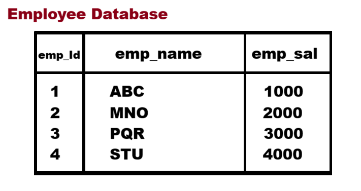

2. `Hierarchical database` :
<br>The database can manage data in the tree structur/format form of parent and child relationship called as Hierarchical database.
if we thinking the file system of operating system it is example of hirarchical database.

3. `Object Oriented database` :  
<br>Database can store in the form of object attribute and values called as object oriented database.
<br>Example of object Oriented database in MongoDB:
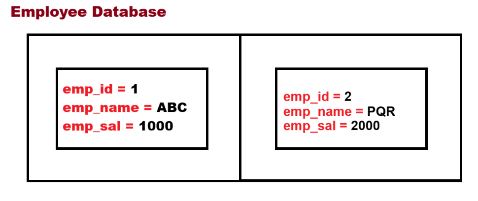

4. `Cloud database `:
<br>Database which is not present on user machine and accessible and modified by cloud.

5. `Distributed database`:
<br>Distributed database means we have multiple databases present on remote location and communicating with each other called a distributed database.

----

Now we want to work with Relational database management or RDBMS<br>
if we want to work with RDBMS we have multiple tools vendors <b>eg., MYSQL, Oracle, DB2, PostgreeSQL.</b><br>
Now we Work with MYSQL

---


> <b>What is MYSQL ?</b>
<br>
MYSQL is a database tool wich provides an environment for us to work with Relational Database Management Systems (RDBMS).
<br>
---
> <b>What is the difference between MYSQL, SQL and database?</b>
- MYSQL - is tool reponsible for provide environment to work with relational database.
- SQL - It is Programming Language work with relational database management concept.
- Database - Database is concept or it is technique where we can Orgainize or store our data called as database.
---
> <b>What is the Database in RDBMS?</b>
<br>Collection of tables called database.
1. Create Database:
    ```sql
    create database july2025;
    ```

2. Show the Database:
    ```sql
    show databases;
    ```
3. Use database:
    ```sql
    use july2025;
    ``` 

      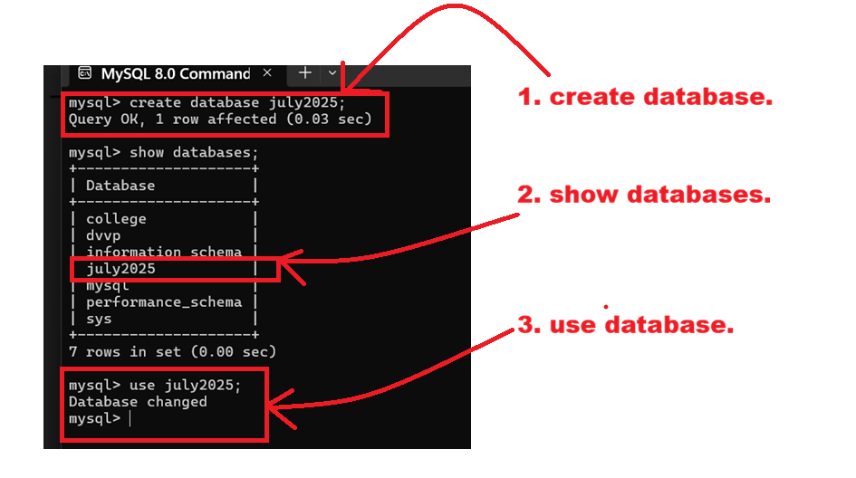
      ---
    once we create database we can work with database and for that we have following commands to work with user database:
    - A. <b>DDL</b>
    - B. <b>DML</b>
    - C. <b>DQL</b> 
    - D. <b>TCL</b>
    - E. <b>DCL</b>

---


> A. **DDL** : Data Definition Language. <br>

- Basically Data definition Language it is used to for **create table, procedure, trigger, function, view database, as well as drop & alter database table,etc.**
- DDL command works with **table structure**.
---
1. **Create** : It is used for create table, create database, create procedure etc.<br>
**Syntax** : create database database_name; <br>
**ex.** 
```
create database july2025;
```
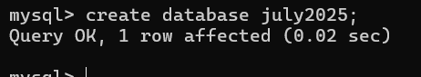

**Syntax** : create table table_name; <br>
**ex.** 
```
create table student(std_Id INT(3),std_name VARCHAR(50),std_fees INT(4));
```

---
2. **Desc** : This command is used for describe the table structure like as column name in table and column data type, column size etc.,<br>
**Syntax** : desc table_name; <br>
**ex.** 
```
desc student;
```
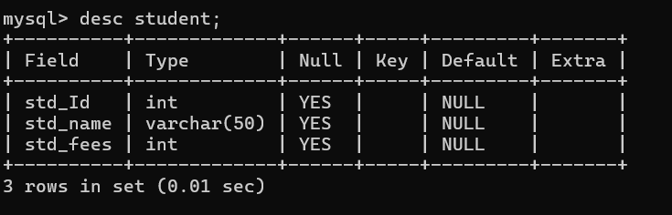
---
3. **alter** : alter is used for modified the column name, add new column, remove column from table, change column type or size, etc.,<br>
*alter commands has some sub-commands*
-  1. Add : this option to help us to add a new column in the database table after the table creation.<br>
**Syntax** : alter table table_name column_name datatype(size);<br>
**ex.** 
```
alter table student add std_dept VARCHAR(60);
```


---
-  2. Modify : Using a modify option we can change only size and data type of column.<br>
**example** : if we think about above table we have *std_dept* column with data type *VARCHAR* and size *30* we want to modified *std_dept* size to *50* . <br> 
**Syntax** : alter table table_name column_name datatype(size);<br>
**ex.** 
```
alter table employee modify std_dept int(50);
```
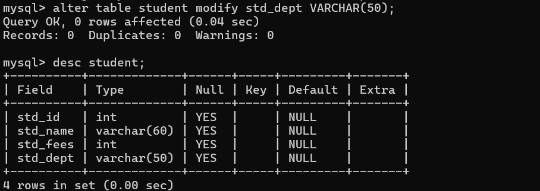
---
-  3. drop : drop is used to remove the column from database table. <br>
**example** : if we think about the above table we have the *std_dept* column and we want to remove it from the student table. <br>
**Syntaxt** : alter table table_name drop columnname; <br>
**ex**
```
alter table student drop std_dept;
```
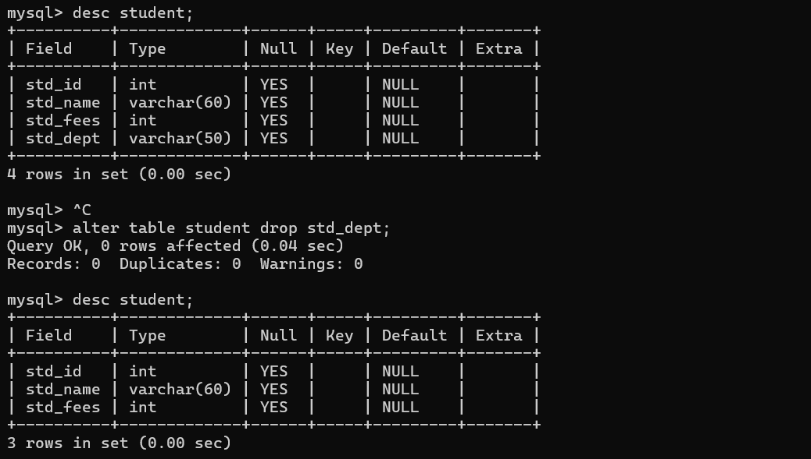

-   4. Rename : rename option is used for change the name of column. <br>
**Syntax** : alter table tablename rename column oldcolumnname to newcolumnname. <br>
**ex**: if we think about above table student we have *std_name* so we want to modify *std_name* to *std_nm* . <br>
```
alter table student rename column std_name to std_nm;
```
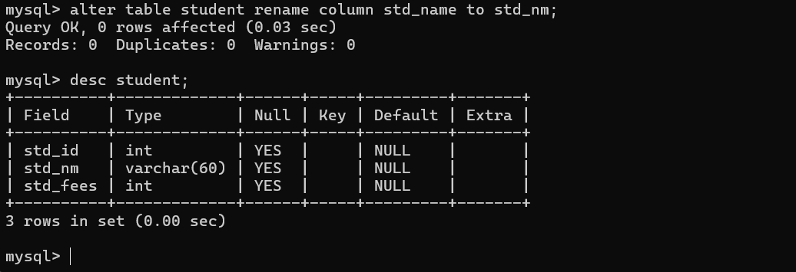
---
4. **Drop** : drop statement is used for the drop the table or drop or delete database, procedure, trigger, function, index etc., <br>
**Syntax** : drop table tablename;
```
drop table student
```
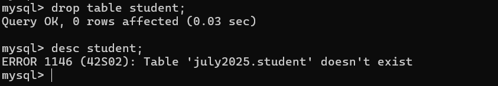
---
5. **truncate**: This statement is used in database to delete the table data. <br>
**Syntax** : truncate tablename;
```
truncate tablename;
```
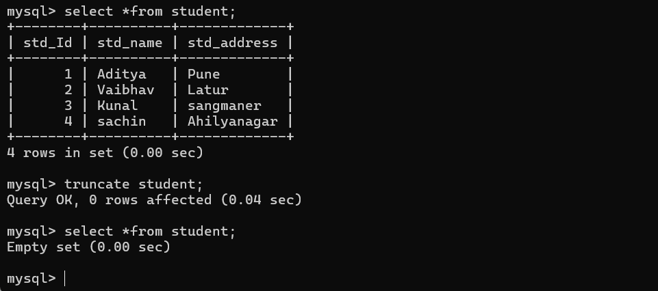
---
> B. **DML** : Data Manipulation Language. <br>
- Data manipulation langauge is work with a table data.
- Basically Data Manipulation Language is used to **Insert** , **Update** and **delete** data in database table.
---
-   1. **Insert** : Iset is used used for inserting the data in the database table. <br>
     - **There are two types of Insert commands** :
     >1. **Wild card insert** : wild card insert means we can isert **all column data** or **provide value to all column** in **row** called as wild card insert. <br>
     **Example :** Suppose we have student table with three field *std_Id* , *std_name* and *std_address* and we want to store data in that. 
     ```
    insert into student values(1,'Aditya','Pune');
     ```
     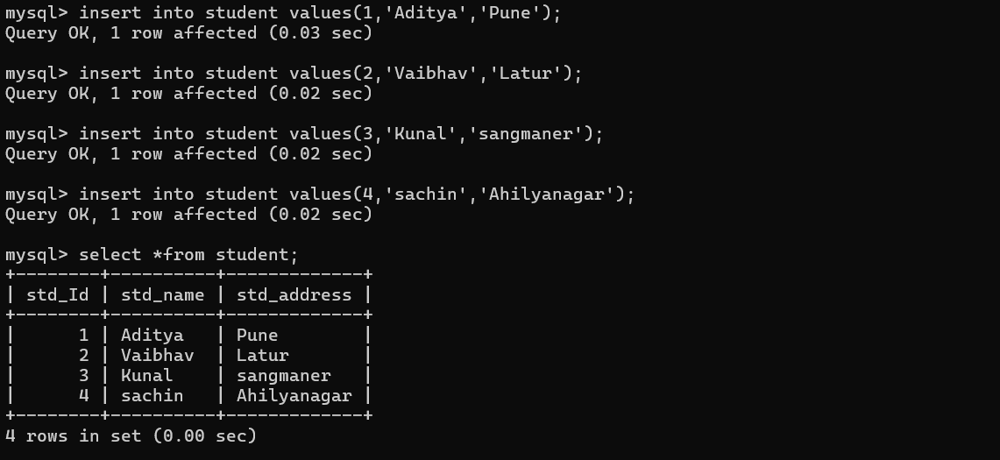
     >2. **Partial insert** : partial insert means we can provide value to a specific column in row called **_Partial insert_**.<br>
     **Syntax** : insert into tablename (column1,column,column...n) values(value1,value2,va;ue...n);<br>
     **example** : suppose cansider we have student table with three column *std_Id* , *std_name* and *std_address* but we want to provide value to *std_Id* and *std_name* only not to *std_address*.
     ```
     insert into student (std_Id,std_name)values(5,'Yash');
     ```
     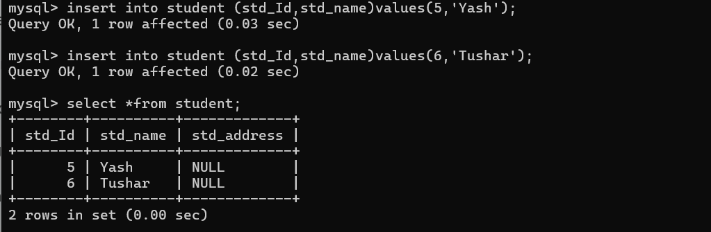
---
-   2. **Delete** : delete data from database table or data from table. <br>
    - **There are two types of Insert commands** :
     >1. **Wild card delete** : delete all record from table. <br>
     **Syntax** : delete from tablename; <br>
     **example** : delete from student; : delete all records from table.
     ```
    delete from student;
     ```
    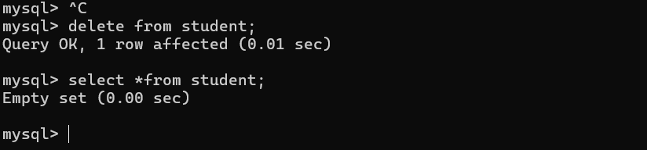

     >2. **Partial delete** : We can achive using *WHERE* consdition means we can delete specific records by using condition. <br>
     **Syntax** : delete from tablename where condition; <br>
     **example** : delete from student where std_Id=6;: delete all records from table.
     ```
    delete from student where std_Id=6;
     ```
    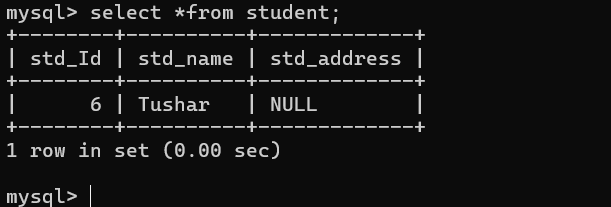
---
-   2. **Update** : update is it used for modify the column data. <br>
**Syntax** : update tablename set columnname = value; :update all data in column using every row.
```
update student set std_address = 'Pune';
```
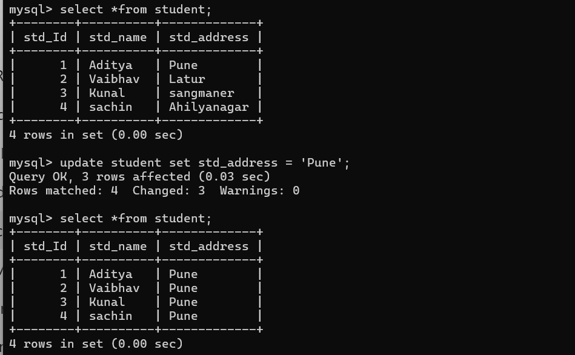
---
We can update specific row or update specific column using condition where clause.<br>
**Syntax** : update tablename set column = value where condition; <br>
**example** : If we think the above table data and we want to change the address of student where student id is 2 which means to change 'Pune' to 'Mumbai'.
```
update student set std_address = 'Mumbai' where std_Id=2;
```
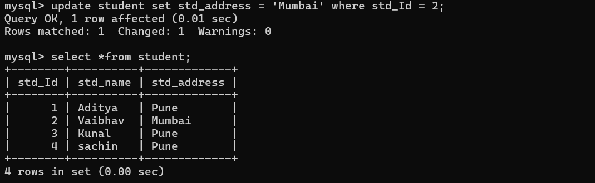
---
> B. **DQL** : Data Query Language. <br>
- Basically the Data Query Language (DQL) is used for to fetch or retrive data from database tables.
- **There are two types of Insert commands** :
     >1. **Wild card select** : Wild card select is denoted by *means we fetch or retrive data from all rows with all columns.
     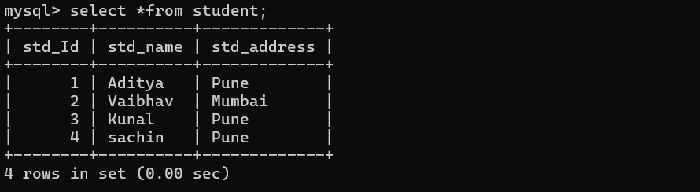
     >1. **Partial select** : We can retrive specific column data from table called as **Partial select**.<br>
     **Syntax** : select column1, column2,...column...n from tablename; <br>
     ```
    select std_Id, std_address from student;
     ``` 
     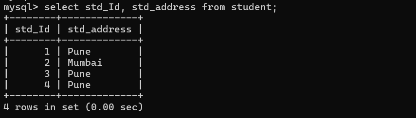
---


### 🗑️ SQL: DELETE vs TRUNCATE vs DROP

A beginner-friendly guide to understand the differences between `DELETE`, `TRUNCATE`, and `DROP` in SQL.

---

### 🔹 1. DELETE

 **➤ What it does**
Removes **selected rows (data)** from a table.<br>
**➤ Works on**
- ✅ Table rows (data)
- ❌ Entire database <br>

**➤ Syntax**
```sql
DELETE FROM table_name WHERE condition;
````

**➤ Key Points**

* Can delete **specific rows** using `WHERE`
* Table **structure remains**
* Slower (row-by-row deletion)
* Can be **rolled back** (inside transactions)

**➤ Example**

```sql
DELETE FROM employees WHERE id = 5;
```

---

### 🔹 2. TRUNCATE

**➤ What it does**

Removes **all rows** from a table quickly.<br>

**➤ Works on**

* ✅ Whole table data
* ❌ Entire database

**➤ Syntax**

```sql
TRUNCATE TABLE table_name;
```

**➤ Key Points**

* Deletes **all rows only** (no `WHERE`)
* Table **structure remains**
* Very fast (minimal logging)
* Resets `AUTO_INCREMENT`
* Usually **cannot rollback**

**➤ Example**

```sql
TRUNCATE TABLE employees;
```

---

### 🔹 3. DROP

**➤ What it does**

Deletes the **entire object** (table or database).

**➤ Works on**

* ✅ Table
* ✅ Database

**➤ Syntax**

```sql
DROP TABLE table_name;
DROP DATABASE database_name;
```

**➤ Key Points**

* Deletes **structure + data**
* Object **no longer exists**
* Cannot rollback

**➤ Example**

```sql
DROP TABLE employees;
DROP DATABASE company_db;
```

---

## 🧠 Quick Summary

* **DELETE** → Remove specific rows (safe & flexible)
* **TRUNCATE** → Remove all rows quickly (keep table)
* **DROP** → Remove entire table/database (dangerous)

---

## 🎯 When to Use What?

* Use **DELETE** → When you need to remove specific records
* Use **TRUNCATE** → When you want to quickly empty a table
* Use **DROP** → When you want to permanently remove a table or database

---

## ⚠️ Important Tip

> Always use `WHERE` with `DELETE` to avoid accidental full data loss.

```sql
-- Dangerous ❌
DELETE FROM employees;

-- Safe ✅
DELETE FROM employees WHERE id = 10;
```

---
- ### `where` clause :<br>
    **where** clause is used for apply condition SQL statement and query Means we can apply where clause with *delete*, *select* or *update* *statement*.<br>
    - How to use `where` caluse with *select* statement.<br>
    - **Sysntax** : select *from tablename where condition;<br>
    - **Example** : we want to fetch data of student whose Id is 2.
    ```
    select *from student where std_Id=1;
    ``` 
    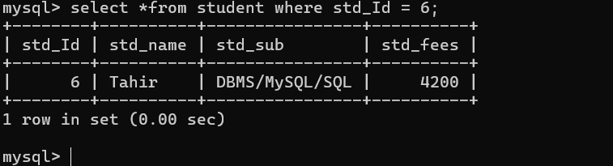
---
- ### **Logical Operator** <br>
    Logical operator is used to combining more than one condition and Making it as a single condition.
    1. `&&` or `and` : this is used fro apply && operator means if all conditions are true then condition is true otherwise condition is false. <br>
    2. `||` or `or` : this is used for apply || operator means if any condition true then condition is true otherwise condition is false. <br>
    3. `!` : if true condition then flase and if false then true. <br>
    **Examples** : using `&&`, `||`, `!` operators. <br>
        1. Write a Query to fetch student whose id is 5 and fees is 5000.
        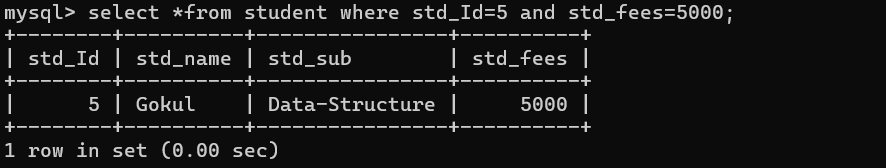
        2. Write a Query to fetch student whose name is *aniket* or fees is 3005.
        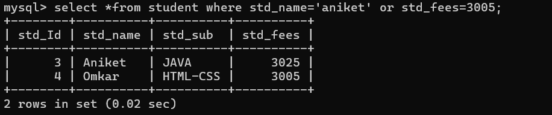
        3.Write a Query to fetch student whose id is not 2.
        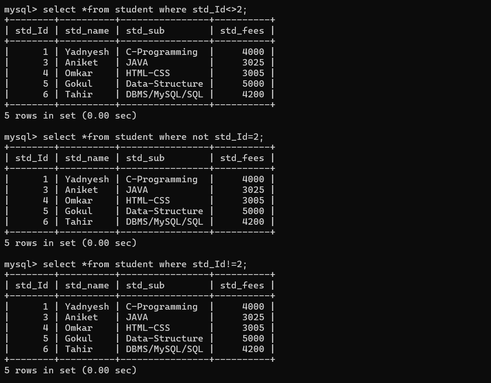
---
- ### `IN`, `Between` : 
    **`IN` Operator** : IN operator is alternative for multiple OR condition means when we use more than one OR condition with single column in query then we use IN operator as well as IN Operator is used for write subquerry.<br>
    **Syntax** : select *from tablename where columnname IN(value1,value2,value...n);<br>
    **Example** : Write a Query to fetch student whose fees is (3005.3025,5000)
    ```
    select *from student where std_fees IN(3005,3025,5000);
    ``` 
    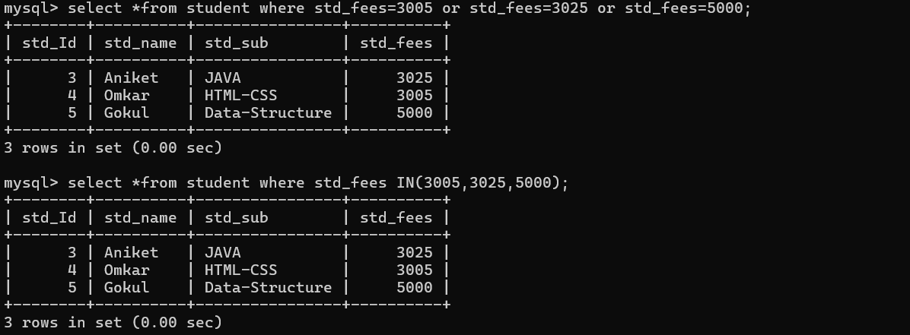
    ---
    **`Between` Operator** : Between Operator is used to fetch data betweeen range of specified value such as >= and <=. <br>
    **Syntax** : select *from tavlename where columnbame between begval and targetvalue; <br>
    **Example** : Write a Query to fetch student data whose salary in range between 4000 to 5000.
    ```
    select *from student where std_fees between 4000 and 5000;
    ```
    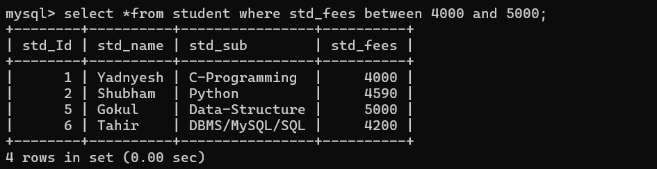
---
- ### 4. **Group by** : 
    Before group by clause we need to know `Aggregate` function or `group` frunction.
    - **Aggregate** function or **group** function <br>
    Aggregate function known as group function and it is used for fetch data from column or specified column result the single value as result. <br>
    **Types of Aggregate Function :**
    ---
    **A. `count` :** count function is used for count number of records in table or row in table.
    - There are Two ways to use count function:
      1. `select count(colname) from tablename` : when we pass column name is count function then we can count only non nun values present in column.
      2. `select count(*) from tablename` : when we pass `*` (wild card operator) in count function then we count not null as well as null from column.<br>
      **Example of `count` function**
      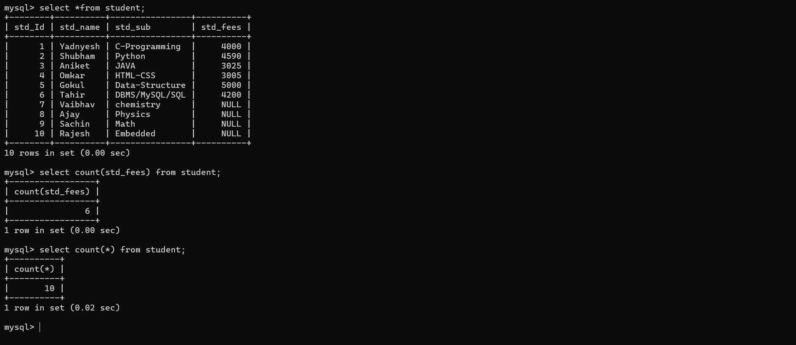
      ---
      **B. `max` :** This function is used to return max value from column.<br>
      **Syntax** : select max(columname) from tablename;

      ---

      **C. `min` :** This function is used to return min value from column.<br>
      **Syntx** : select min(columname) from tablename;<br>

      ---

      **D. `sum` :** This function is used to return sum of all values present in that column.<br>
      **Syntax** : select sum(coumname) from tablename. <br>

      ---

      **E. `avg` :** avg function is used for calculate the average value of column means internally sum of all non null value / count of non null value.<br>
      **Syntax** : select avg(columname) from student; 

      ---
      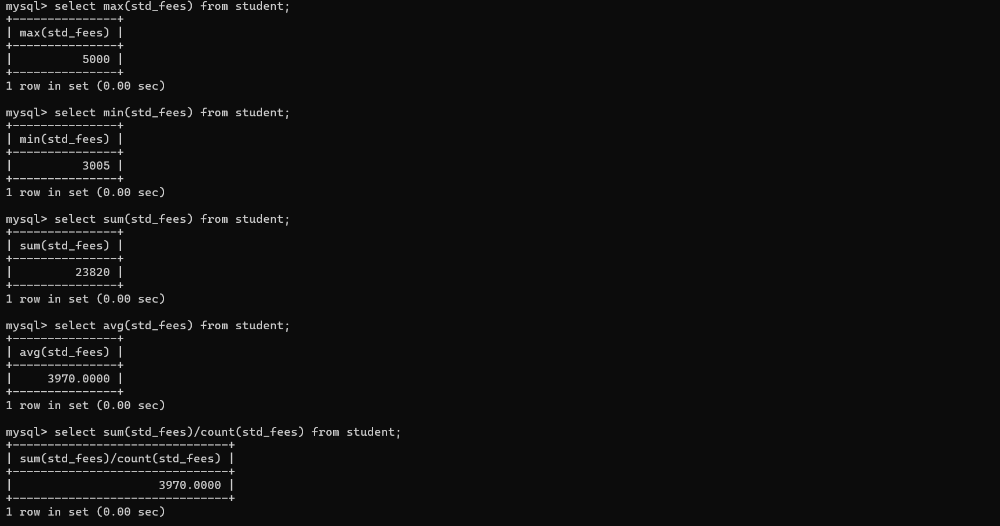
      ---
      - ###  **Group by clause** :
         group by clause is used to for perform grouping of similar values using specific column and normally group by clause work with aggregate function or group function.<br>
         **Syntax** : select columname from tablename where group by columnname;<br>
         > Important points related with group by clause
         ---
         - a. we can use column name with select statement whose name use with group.
         - b. we can use aggregate function or group function in select query when use group by with select.<br>
         **example** : Write a Query to find student count who having fees.
         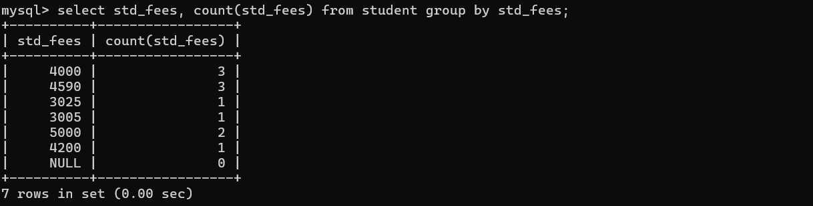
---
- ### 5. **having** :
    Having clause is used for checked condition with group by clause Normally we cannot use group function or aggregate function with where clause for the check condition then we can use having with group by clause.<br>
    **Note** : We cannot use the having clause without group by clause.<br>
    **Syntax** : select columnname, groupfuntion(column) from tablename group by columnname having condition.<br>
    **Example** : Write a Query to find duplicate fees from student table.
    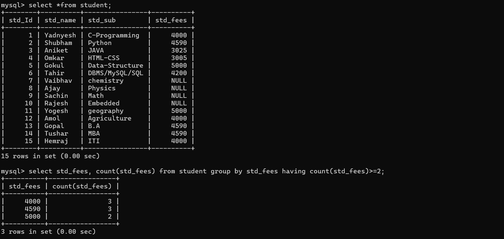
---
- ### 6. **having** :
    Arrange the table data in ascending or descending order.<br>
    **Syntax** : select *from tablename by columnname desc | asc 
    ```
    select *from student desc;
    ```
---

- ### 7. **Like operator** :
    Like operator is used for pattern matching operator or write pattern query normally it is used for searching purpose. Means we have some search pattern then we have use the like as operator.<br>
    **Example** : Suppose consider we have the student table and we want to find student whose name start with r ot ends with sh or name contains at least three letters etc.,<br>
    **Syntax** : select *from student where columnname like pattern; <br>
    *If we want to work with like operator we have some wild card characters given below : <br>
    - `%` : this operator indicate zero or more character.
    - `_` : this pattern represents single characters.
    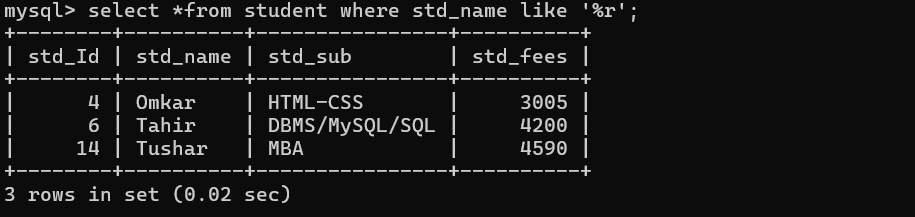
    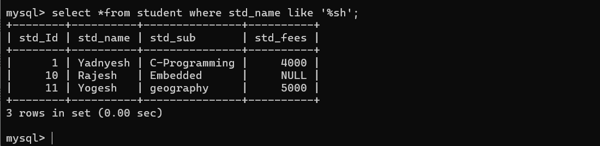
    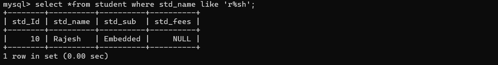
    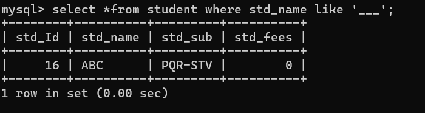
    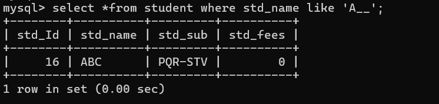