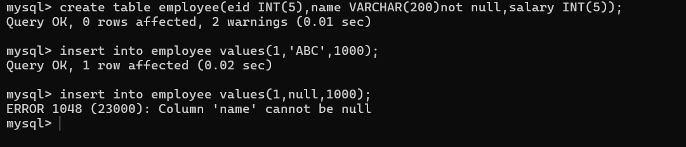
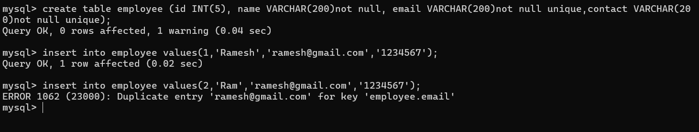

>## **Constrints in SQL** 

Constraint are the some rules and regulation which can apply on table column at the time of table creation.
- **A. Verify data before insert in database table.**
- **B. Maintain Uniquness in data.**
- **C. Avoid to insert wrong data in database table.**
- **D. Maintain relationship between two tables.**
- **E. To maintain the consistency in data.**
---
- >**Types of constraints in SQL**
### 1. **Not null** : 
- When we use the not null constraints with column then we cannot store null value in column bacause of every column by default has null Value.  <br>
- **Syntax** : create table tablename (columnname datatype(size) not null, columnname datatype(size)not null);
```
create table employee(eid INT(5),name VARCHAR(200)not null,salary INT(5));
```

---
### 2. **Unique** :
- Unique constraints  is used to store the unique value in column means we can not store duplicate values in column using unique constraints .<br>
- **Syntax** : create table tablename (columnname datatype(size)unique...);<br>
- **Example** :  Suppose create table name as employee with column id,name,email,contact , salary and here contact and email should be unique and name should not null.

---
###2. **Primary** :
- Primary key constraints  is by default 
