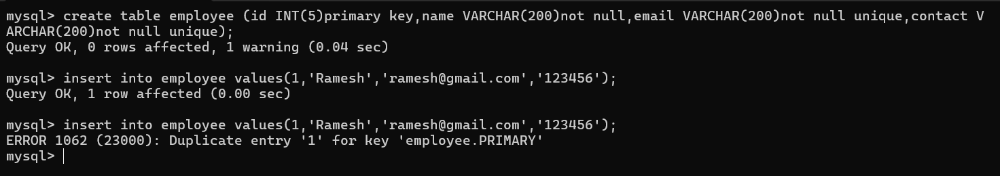
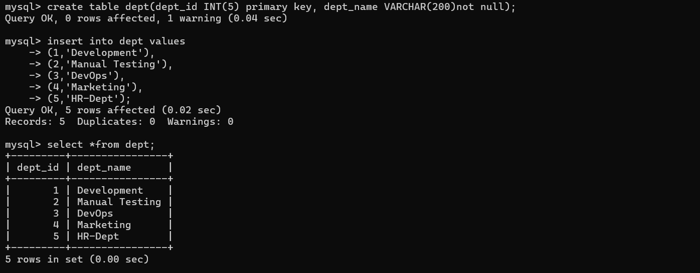
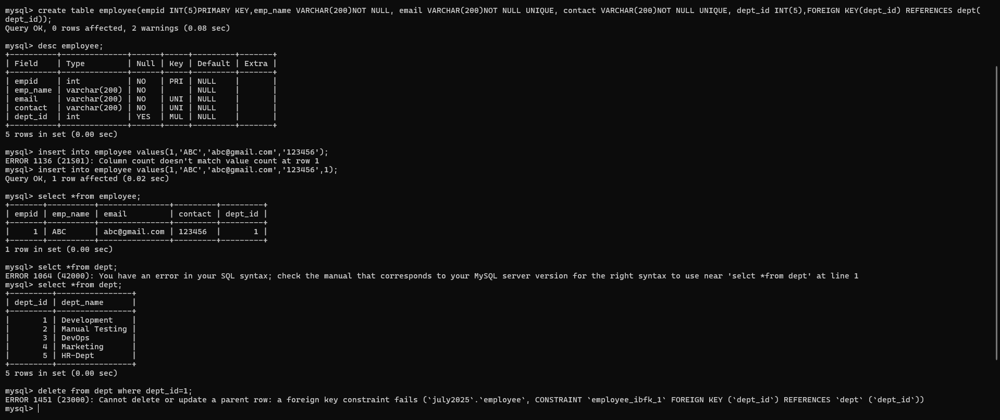
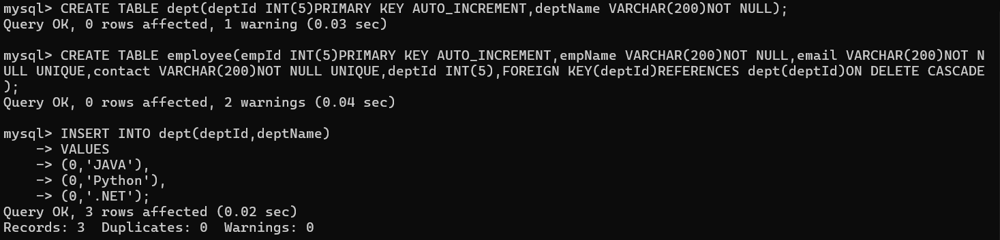
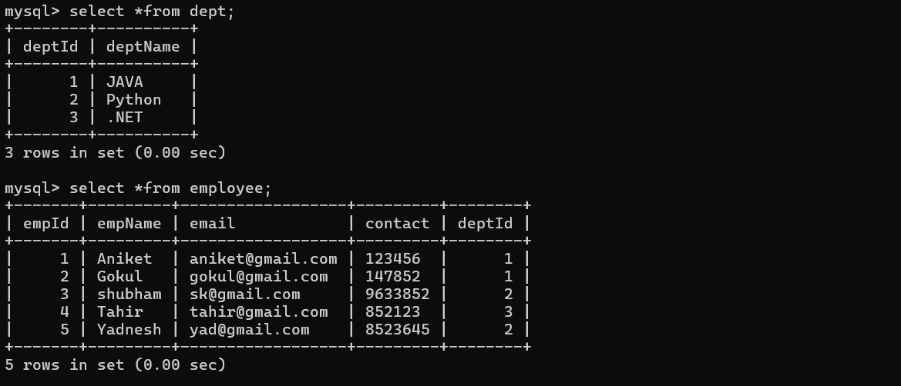
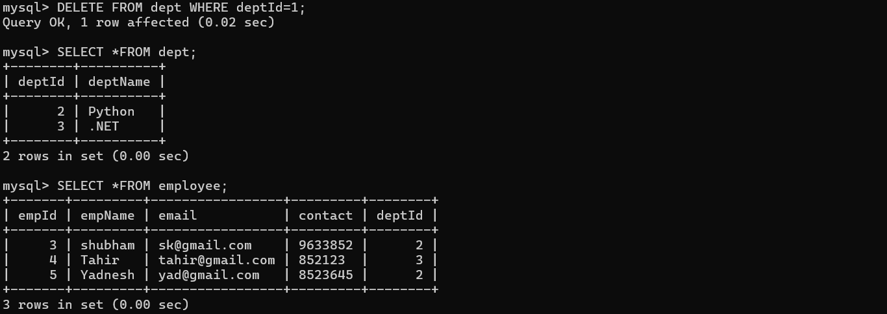
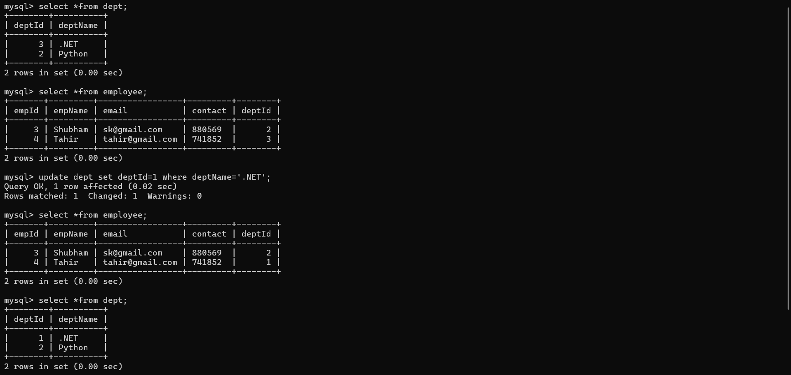
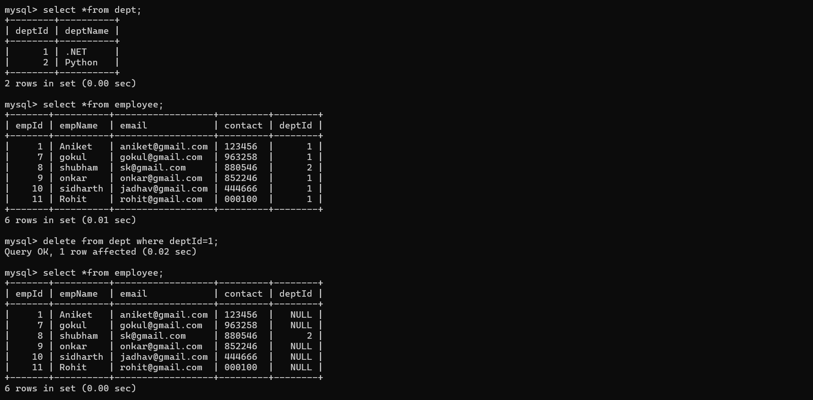
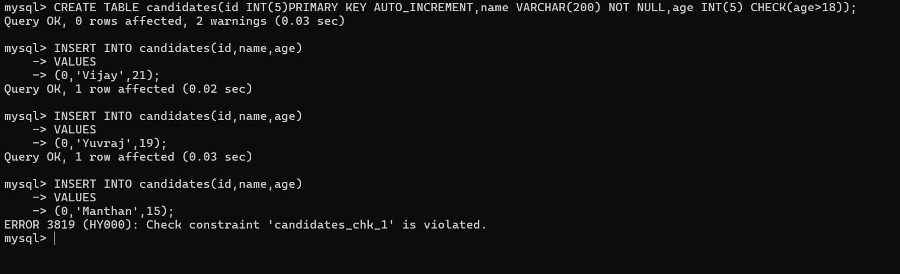

>## **Constraints in SQL** 

Constraint are the some rules and regulation which can apply on table column at the time of table creation.
- **A. Verify data before insert in database table.**
- **B. Maintain Uniquness in data.**
- **C. Avoid to insert wrong data in database table.**
- **D. Maintain relationship between two tables.**
- **E. To maintain the consistency in data.**
---
- >**Types of constraints in SQL**
### 1. **Not null** : 
- When we use the not null constraints with column then we cannot store null value in column bacause of every column by default has null Value.  <br>
- **Syntax** : create table tablename (columnname datatype(size) not null, columnname datatype(size)not null);
```
create table employee(eid INT(5),name VARCHAR(200)not null,salary INT(5));
```

---
### 2. **Unique** :
- Unique constraints  is used to store the unique value in column means we can not store duplicate values in column using unique constraints .<br>
- **Syntax** : create table tablename (columnname datatype(size)unique...);<br>
- **Example** :  Suppose create table name as employee with column id,name,email,contact , salary and here contact and email should be unique and name should not null.

---
### 3. **Primary** :
- Primary key constraints  is by default not null and unique means we mark any column as primary key then we cannot store null value in it and duplicate value in it.<br>
- **Syntax** : create table tablename (columnname datatype(size)primary key...);
- **Example** :  we want to create employee table and every employee id should be unique and not null ,name not null, email unique and not null and contact unique and not null.
```
create table employee(eid int(5) primary key, name varchar(200) not null, email varchar(200) not null unique, contact varchar(200) not null unique);
```

---
> **What is the difference between Primary key and Unique key constraints ?**


| Primary Key | Unique Key |
|-------------|------------|
| We can create only one column as primary key in whole table. | we can create more than one column as unique key in single table. |
| Primary is by default not null and unique. | Unique is not by default null means can hold null value. |
| Primary key use by default cluster index. | Unique key use cluster or secondary index. |
| Primary key can use as a reference in another table i.e mark a foregin key and it is recommended. | Unique key is not recommended as foregin key in child table. |

---
### 4. **Foregin Key** :
- Foregin key constraints is used for maintain the relationship between two tables means we can use primary key of some another table as foregin key in other table and primary key column table known as parent table and foregin key column table known as child table.
- **How to create foregin key column**:
- **Syntax** : create table tablename(columnname datatype(size),foregin key (columname)reference paranttablename(primarykey column));
- **Example** :



    If we want to delete the relationship developed entry then we have to 


- But this approach is not recommended when large database.
- If we want to delete primary key record or update primary key record then child record should be automatically delete or update then we have three type of constraints: 
1. On delete cascade.
2. On update cascade.
3. On delete set null.<br>
These constraints only work with foreign key constraints.
---

>### **1. ON DELETE CASCADE** <br>

- This constraints help us to delete the child record automatically when parent record get deleted.

```
--table -1 

create table dept(deptId INT(3) PRIMARY KEY AUTO_INCREMENT,deptName VARCHAR(200));

--table -2

create table employee(empId INT(5)PRIMARY KEY AUTO_INCREMENT,empName VARCHAR(200)NOT NULL,email VARCHAR(200)NOT NULL UNIQUE,contact VARCHAR(200)NOT NULL UNIQUE,deptId INT(5),FOREIGN KEY(deptId)REFERENCES dept(deptId)ON DELETE CASCADE);
```




>  After delete records using **ON DELETE CASCADE**



---
>### **2. ON UPDATE CASCADE** <br>

-  When we update primary key then child record update automatically.




>### **3. on delete set null** <br>

- These constraints on delete set null means when we delete the parent record then child record set null automatically in foreign key column so we can use on delete set null constraint with foreign key.<br>
   - a.  On delte cascade and on delete cascade can use at a time.
   - b.  On delete cascade and on delete casecade set null cannot use same time with same column.
   - c.  On delete set null and on update cascade can use same time with same column. 
  


---

### 5. **Check constraints** :
- This constraints is used for apply condition with column at the time of table creation.
- **Syntax** : create table tablename(columnname datatype(size) check (condition),...);
- **Example** : Suppose consider we are working on voting application and we want to create table for vote but the rule is if voter age is below 18 then record of voter should not accept by database.
  ````
  -- create the table first

  create table candidates(id INT(5)PRIMARY KEY AUTO_INCREMENT, name VARCHAR(200)NOT NULL,age INT(5) CHECK(age>18));


  -- insert data into table

  insert into candidates(id,name,age)
  VALUES
  (0,'Vijay',18); 

  -- if we insert age > 18 then we get error.
  ````
  

  ---

### 6. **Default constraints** :
-  Default constraints is used for pass default value to column and by default every column has null as default value and when user set default value at the time of table creation and if user not provide value to that column then database by default store default set by user at the time of table creation.
-  **Syntax** :
