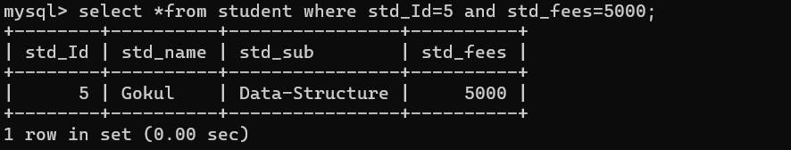
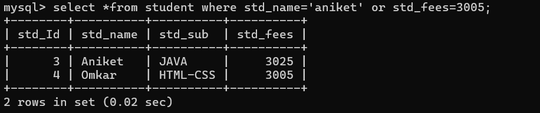
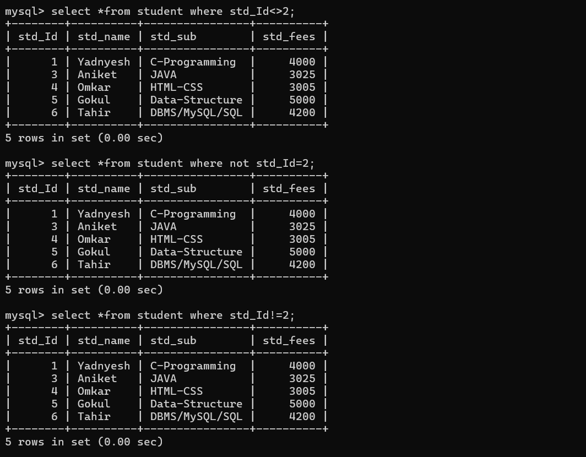
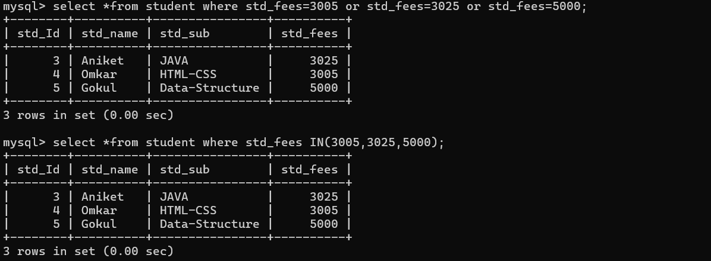
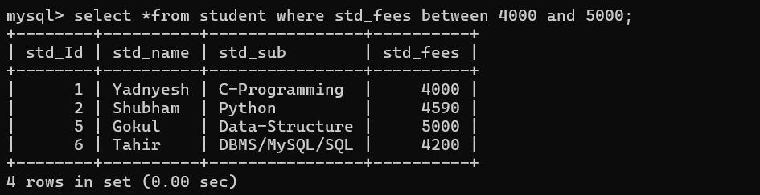
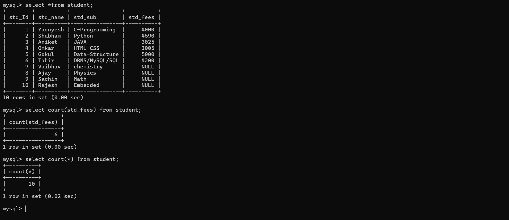
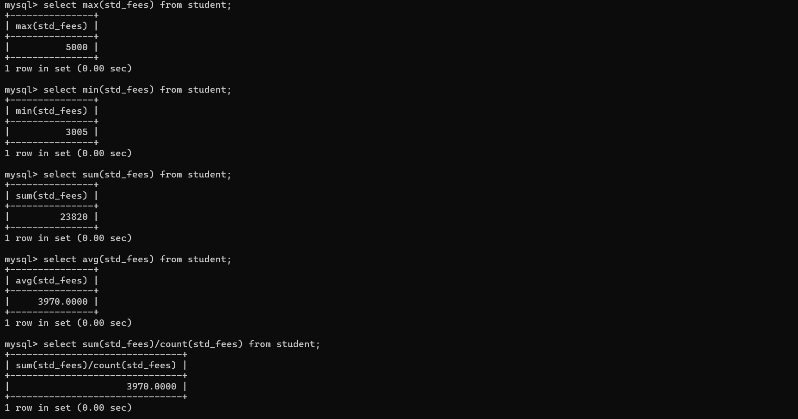
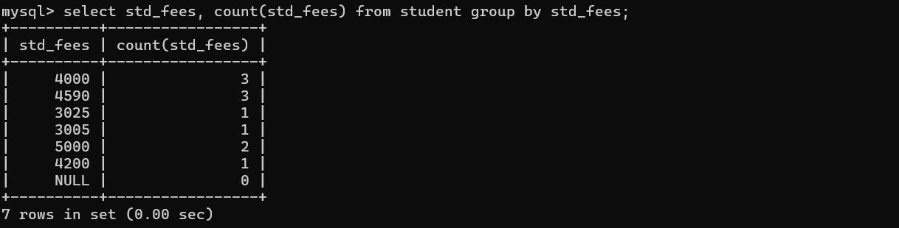
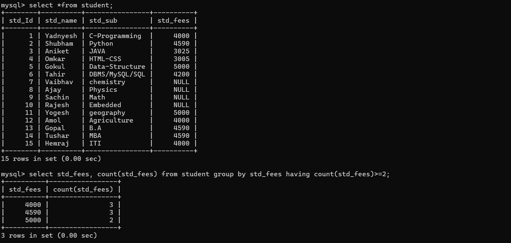

## **Clauses in SQL** 🏛️

- ### `where` clause :<br>
    **where** clause is used for apply condition SQL statement and query Means we can apply where clause with *delete*, *select* or *update* *statement*.<br>
    - How to use `where` caluse with *select* statement.<br>
    - **Sysntax** : select *from tablename where condition;<br>
    - **Example** : we want to fetch data of student whose Id is 2.
    ```
    select *from student where std_Id=1;
    ``` 
    
---
- ### **Logical Operator** <br>
    Logical operator is used to combining more than one condition and Making it as a single condition.
    1. `&&` or `and` : this is used fro apply && operator means if all conditions are true then condition is true otherwise condition is false. <br>
    2. `||` or `or` : this is used for apply || operator means if any condition true then condition is true otherwise condition is false. <br>
    3. `!` : if true condition then flase and if false then true. <br>
    **Examples** : using `&&`, `||`, `!` operators. <br>
        1. Write a Query to fetch student whose id is 5 and fees is 5000.
        
        2. Write a Query to fetch student whose name is *aniket* or fees is 3005.
        
        3.Write a Query to fetch student whose id is not 2.
        
---
- ### `IN`, `Between` : 
    **`IN` Operator** : IN operator is alternative for multiple OR condition means when we use more than one OR condition with single column in query then we use IN operator as well as IN Operator is used for write subquerry.<br>
    **Syntax** : select *from tablename where columnname IN(value1,value2,value...n);<br>
    **Example** : Write a Query to fetch student whose fees is (3005.3025,5000)
    ```
    select *from student where std_fees IN(3005,3025,5000);
    ``` 
    
    ---
    **`Between` Operator** : Between Operator is used to fetch data betweeen range of specified value such as >= and <=. <br>
    **Syntax** : select *from tavlename where columnbame between begval and targetvalue; <br>
    **Example** : Write a Query to fetch student data whose salary in range between 4000 to 5000.
    ```
    select *from student where std_fees between 4000 and 5000;
    ```
    
---
- ### 4. **Group by** : 
    Before group by clause we need to know `Aggregate` function or `group` frunction.
    - **Aggregate** function or **group** function <br>
    Aggregate function known as group function and it is used for fetch data from column or specified column result the single value as result. <br>
    **Types of Aggregate Function :**
    ---
    **A. `count` :** count function is used for count number of records in table or row in table.
    - There are Two ways to use count function:
      1. `select count(colname) from tablename` : when we pass column name is count function then we can count only non nun values present in column.
      2. `select count(*) from tablename` : when we pass `*` (wild card operator) in count function then we count not null as well as null from column.<br>
      **Example of `count` function**
      
      ---
      **B. `max` :** This function is used to return max value from column.<br>
      **Syntax** : select max(columname) from tablename;

      ---

      **C. `min` :** This function is used to return min value from column.<br>
      **Syntx** : select min(columname) from tablename;<br>

      ---

      **D. `sum` :** This function is used to return sum of all values present in that column.<br>
      **Syntax** : select sum(coumname) from tablename. <br>

      ---

      **E. `avg` :** avg function is used for calculate the average value of column means internally sum of all non null value / count of non null value.<br>
      **Syntax** : select avg(columname) from student; 

      ---
      
      ---
      - ###  **Group by clause** :
         group by clause is used to for perform grouping of similar values using specific column and normally group by clause work with aggregate function or group function.<br>
         **Syntax** : select columname from tablename where group by columnname;<br>
         > Important points related with group by clause
         ---
         - a. we can use column name with select statement whose name use with group.
         - b. we can use aggregate function or group function in select query when use group by with select.<br>
         **example** : Write a Query to find student count who having fees.
         
---
- ### 5. **having** :
    Having clause is used for checked condition with group by clause Normally we cannot use group function or aggregate function with where clause for the check condition then we can use having with group by clause.<br>
    **Note** : We cannot use the having clause without group by clause.<br>
    **Syntax** : select columnname, groupfuntion(column) from tablename group by columnname having condition.<br>
    **Example** : Write a Query to find duplicate fees from student table.
    
---