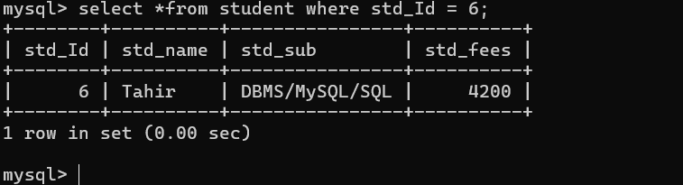

## **Clauses in SQL** 🏛️

- ### `where` clause :<br>
    **where** clause is used for apply condition SQL statement and query Means we can apply where clause with *delete*, *select* or *update* *statement*.<br>
    - How to use `where` caluse with *select* statement.<br>
    - **Sysntax** : select *from tablename where condition;<br>
    - **Example** : we want to fetch data of student whose Id is 2.
    ```
    select *from student where std_Id=1;
    ``` 
    
---